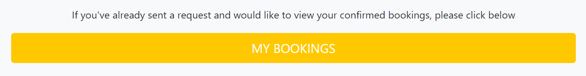

# Scissorhand's Barbers

Scissorhand's Barbers is a fictional barbershop situated in York, England. The aim of this site is to allow users the ability to make booking requests, view their confirmed bookings and to write and read testimonials.

The site is responsive and has been styled using the Agency theme from [StartBootstrap](https://startbootstrap.com/theme/agency). Languages and frameworks used for this project are HTML, CSS, JavaScript, Python and Django. Agile methodology has been used to plan and design this project using an MVC framework.

The live link to this project can be found here - http://scissorhands-barbers.herokuapp.com/

## User Stories

### First Time Visitor Goals:
1. As a First Time Visitor, I should be able to view offered services.
2. As a First Time Visitor, I should be able to read about the business.
3. As a First Time Visitor, I should be able to view testimonials.
4. As a First Time Visitor, I should be able to make an account.

### Returning Visitor Goals:
5. As a Returning Visitor, I should be able to request a booking.
6. As a Returning Visitor, I should be able to view my bookings.
7. As a Returning Visitor, I should be able to cancel or delete my bookings.
8. As a Returning Visitor, I should be able to write a testimonial.
9. As a Returning Visitor, I should be able to edit or delete my testimonials.

### Site Admin Goals:
10. As a Site Admin, I should be able to approve testimonials in order to filter spam or bad language.
11. As a Site Admin, I should be able to confirm bookings to minimize risk of double bookings.

## Design

- The initial design of this project was done via a Theme named Agency, a downloaded theme from [StartBootstrap](https://startbootstrap.com/theme/agency). I chose this theme because I felt it refelected the branding that I was trying to create for this business, a quirky, vintage themed Barbershop located in York, England. I then altered this theme to meet my own requirements.

## Features 

### Existing Features

- __Header/Navigation Bar__
  - This is featured on all pages and is fully responsive. This area includes links to the page sections Services, About, Locate Us as well as pages for Testimonials and Bookings. If the user is not logged in then there are links to register or login in. If the user is already logged in then there is a link to logout. This is replicated on each page to make navigation easier. For smaller screen sizes, the navbar becomes a drop down.
  - The logo is displayed in the top left of the page with navigation links displayed to the right.
  - The navigation bar allows users to be able to easily navigate between all sections and pages, on all devices.   

  
  

- __The Landing Page/Masthead__

  - This section includes a photograph with text overlay to allow users to see exactly what the business is.
  - The masthead image is located on all pages to tie the full site together, I chose this image as it reflected the vintage style and branding I was trying to create for this business.
  - The landing page masthead displays a welcome message, a slogan and a button which navigates to the services section. On all other pages, this just displays the page name.
  - If the user is logged in to the site then the welcome message greets the user, asks if the user is due another hair cut and the button navigates to the bookings page.

  
  

- __Services__
  - This section allows users to see what services are offered at this barbers and the images used reflect this.
  - To further add to the branding and show users what Scissorhand's is about, a subheading of "Vintage Cuts, Modern Styles" is included in this section.
  - Also included is a brief paragraph with the aim in showing further services offered and that Scissorhand's caters for all potential clients regardless of their age.

  

- __About__
  - This section allows users to learn abit about the business as well as information about the barbers.
  - In this section, I have wrote a brief history of the business and an introduction of the barbers such as when they qualified and what they like to do. This is to give the business a more welcoming feel towards new users.
  - Also included here are photographs of the barbers, again to provide new users with with a sense of familiarity towards the business.

  
  
  
- __Locate Us__
  - This section allows users to see the location of the barbershop.
  - In this section, users can see the address of the business as well as Google map of the location.
  - For this section, I have used a Google Map API to show an exact, marked location of where the barbershop would be situated. I thought this added a nice touch to the page and made for a better user experience. 

  

- __Testimonials__
  - This page allows all users to be able to view confirmed testimonials.
  - By logging in to the site, users have the ability to write testimonials as well as the ability to edit or delete any testimonials that are being rendered to the testimonials page, as long as they are the ones that have have created them.
  - On submission of a testimonial, an alert is displayed that states "Your testimonial is awaiting approval", this is to provide confirmation to the user that the testimonial has been sent, as it will not be rendered on the testimonials page until it has been admin approved.
  - If an approved testimonial is edited, then the testimonial approval will be set back to False and will need to be approved again before it is rendered to the testimonials page.
  - This page is paginated so that only 6 testimonials will be displayed on one page.

  
  

- __Bookings__
  - Users must be logged in to use this section.
  - This page allows users to request a booking slot for a chosen date, time slot, and service with a chosen barber.
  - Users can access thier bookings via the My Bookings link at the bottom of the page. This shows only bookings specific to that user and both confirmed and unconfirmed bookings will be displayed, with unconfirmed bookings being displayed in red text stating unconfirmed.
  - Users have the ability to edit or cancel their confirmed bookings. If a booking is still unconfirmed, then the user is able to delete it.
  - On submission of a booking request, an alert is displayed that states "Your request has been sent and is awaiting confirmation", this is to provide confirmation to the user that the booking request has been sent.
  - If an approved booking is edited, then the booking approval will be set back to False and will need to be approved again. 

  
  
  
  

- __Register/Login__
  - This has been created using Django Allauth.
  - Users have the ability to sign up for an account, log in and log out.
  - This is required to write a testimonial and make a booking request.

  
  

### Features Left to Implement

- A feature I initially intended on implementing, is the ability to automatically confirm appointments that do not clash with other appointments. After toying with this, I decided to conduct a small research task within the barber industry and ask barbers what they would want from a booking system. Out of the 5 business I asked, 3 of them said they would prefer to manually accept bookings themselves because they have a lot of walk-ins and telephone appointments booked, so having automatic confirmation would potentially result ii double bookings with bookings taken via other means. 
- I would like to add the ability to be able to pay for services online after bookings are confirmed.

## Wireframes

All wireframes have been created using [Balsamiq](https://balsamiq.com/wireframes/)

- Landing Page
 -  
- Testimonials
  - Testimonial Page
    - 
  - Write Testimonials
    - 
- Bookings
  - Make A Booking
    - 
  - My Bookings
    - 

## Logic Flowcharts

Flowcharts for the python logic behind this project have been created using [Lucid](https://lucid.app/)

- Booking Logic
  - 
- Testimonials Logic
  - 

## Agile

Agile methodology was used to manage this project by breaking it up into different user stories. This was done via the Github Projects board and creating issues from a user story template. Consulting this throughout the project has helped me keep on track with what features I wanted to include and what I wanted to achieve from this project.

## Testing

I have manually tested this project in the following ways:

- This site has been tested on Chrome, Firefox and Microsoft Edge as well as on different screen sizes via Dev tools and on my own devices. Dev tools has also been used to identify any errors within my HTML and CSS code.
- I have confirmed that both forms work. They require entry in all fields, drop downs require a selected object and the submit button works. For bookings, I have checked that a past date cannot be selected.

### Validator Testing

- Python
  - Any errors or warnings displayed throughout the project in the Github terminal have been addressed.
  - All code has been passed through the [PEP8 Python Validator](http://pep8online.com/checkresult) with no issues.
    - 
- HTML
  - No errors were returned when passing through the official [W3C validator](https://validator.w3.org)
    - 
- CSS
  - No errors were found when passing through the official [(Jigsaw) validator](https://jigsaw.w3.org)
    - 
- Javascript
  - No significant issues were found when passing through the official [JSHint Javascript validator](https://jshint.com/)
  - After investigation, despite displaying that there are two unused and two undefined variables, this is not the case. These are called on outside of the Javascript file.
    - 

- I have checked accessibilty by running through Lighthouse via devtools
  - 

### Security
 - The API Key for Google Maps is restricted to my Heroku app and my Github workspace for this project.

### Bugs

- I encountered an issue where background images within the CSS were not appearing in the Heroku app, after changing the path for these to the Cloudinary URL for those images, they were dispayed.
- Initially, when trying to display the bookings on the my bookings page, all bookings regardless of the user were being displayed. After more research, I was able to solve this by restricting it to if the request user is the booking customer.
- After changing one of my models, I experienced a lot of issues with programming errors, type errors and invalid cursor names. To rectify this I went in to Heroku and reset the database, after migrating again in Github, my page rendered correctly.
- I had another issue where my Google Map was not being displayed within my Heroku app, I realised this was due to the restrictions I had placed on my API key. After adding my app to the allowed list, the map displayed correctly.

### Unfixed Bugs

- No unfixed bugs

### Other Issues

- I have noticed an error within my commits. Whilst resetting the head back to a previous commit, I had an issue with being able to push my code without first pulling it. In the process, multiple commits of the same name have been created, these commits are namely "Comment out x frame options for mock up view" and "Update image paths". I have recognised this and believe it to have been caused by an error of my own making due to having debug set to False whilst still developing this project. Despite my frustrations around this mistake I have accepted this as being another learning oppurtunity for me.

## Deployment

- This project has been deployed to Heroku using the [Django Blog Cheat Sheet](https://codeinstitute.s3.amazonaws.com/fst/Django%20Blog%20Cheat%20Sheet%20v1.pdf) provided by [Code Institute](https://learn.codeinstitute.net/). The steps to deploy are as follows: 
  - In Heroku
    - Create a new Heroku app 
    - Add the database to app resources by going to the resources tab, and searching for Heroku Postgres in add ons
    - In the settings tab, click on config vars and copy the DATABASE_URL text
  - In GitHub
    - Create new env.py file on top level directory
  - In env.py
    - Import os library
    - Set environment variables for the database url
    - Set environment variables for the secret key
  - In Heroku
    - Add the secret key to config vars
  - In settings.py
    - Import the env.py file
    - Remove the insecure secret key and replace
    - Replace DATABASES section
  - In the terminal
    - Make migrations
  - In Cloudinary
    - Copy the CLOUDINARY_URL from Cloudinary dashboard
  - In env.py
    - Add cloudinary url to env.py
  - In Heroku
    - Add Cloudinary URL to Heroku Config Vars
  - In settings.py
    - Add Cloudinary Libraries to installed apps
    - Tell Django to use Cloudinary to store media and static files
      - STATIC_URL = '/static/'
      - STATICFILES_STORAGE ='cloudinary_storage.storage.StaticHashedCloudinaryStorage'
      - STATICFILES_DIRS = [os.path.join(BASE_DIR,'static')]
      - STATIC_ROOT = os.path.join(BASE_DIR, 'staticfiles')
      - MEDIA_URL = '/media/'
      - DEFAULT_FILE_STORAGE ='cloudinary_storage.storage.MediaCloudinaryStorage'
    - Link the file to the templates directory in Heroku. Place under the BASE_DIR line
    - Change the templates directory to TEMPLATES_DIR
    - Add Heroku Hostname to ALLOWED_HOSTS
  - In Gitpod
    - Create 3 new folders on the top level directory (static, media and templates)
    - Create Procfile on the top level directory
  - In Procfile
    - Add code web: gunicorn PROJ_NAME.wsgi
  - In the termimal
    - Add, Commit and Push
      - git add .
      - git commit -m "Deployment Commit"
      - git push
  - In Heroku
    - Go to deploy tab and choose Github as the deployment method
    - Connect to the correct Github repository for the project
    - In manual deploy, select the main branch and click deploy branch

## Credits  

### Content 

- The initial code and styles for this project were taken from [StartBootstrap - Agency Theme](https://startbootstrap.com/theme/agency), then edited and expanded for my own requirements.
- As the size of the StartBootstrap CSS file was excessive, I removed unused CSS with [Uncss Online](https://uncss-online.com/)
- [Stack Overflow](https://stackoverflow.com) was a great source of information throughout the project but was particularly used for help with navigating to specific sections of a page [here](https://stackoverflow.com/questions/55055523/how-to-configure-django-url-to-point-to-a-specific-section-in-the-page), when setting date validation [here](https://stackoverflow.com/questions/4941974/django-how-to-set-datefield-to-only-accept-today-future-dates), for using a datepicker [here](https://stackoverflow.com/questions/3367091/whats-the-cleanest-simplest-to-get-running-datepicker-in-django) and for getting specific user information to be rendered [here](https://stackoverflow.com/questions/61232944/get-user-information-in-django-templates-and-and-checking-whether-its-equal-to).
- [Code Institute](https://learn.codeinstitute.net/) Project 4 tutorials were consulted throughout for clarification and understanding, especially the Django Blog project from the Full Stack Frameworks tutorials which was inspiration for my models and views. Also consulted was the Bootstrap Resume part 2 from help with using Google Maps APIs
- [Eat Sleep Wander](https://eatsleepwander.com/20-barber-review-examples-for-2021/) was used for barbershop reviews and [The Salon Business](https://thesalonbusiness.com/barbershop-slogans/) for barbershop slogans.
- Pagination styles came from [bbbootstrap](https://bbbootstrap.com/snippets/bootstrap-awesome-round-pagination-50703662) and help with setting up pagination came from a tutorial on Youtube by [Codemy](https://www.youtube.com/watch?v=N-PB-HMFmdo).

### Images

- All images used in this project came from [Unsplash](https://unsplash.com/)
  - Masthead image by [Andre Reis](https://unsplash.com/@andrereispt) located [here](https://images.unsplash.com/photo-1592647420148-bfcc177e2117?ixlib=rb-1.2.1&ixid=MnwxMjA3fDB8MHxwaG90by1wYWdlfHx8fGVufDB8fHx8&auto=format&fit=crop&w=2039&q=80)
  - Service images
    - Gents image by [Hair Spies](https://unsplash.com/@hairspies?utm_source=unsplash&utm_medium=referral&utm_content=creditCopyText) located [here](https://images.unsplash.com/photo-1622286342621-4bd786c2447c?ixlib=rb-1.2.1&ixid=MnwxMjA3fDB8MHxwaG90by1wYWdlfHx8fGVufDB8fHx8&auto=format&fit=crop&w=1170&q=80)
    - Shave image [Christoffer Engström](https://unsplash.com/@christoffere?utm_source=unsplash&utm_medium=referral&utm_content=creditCopyText) located [here](https://images.unsplash.com/photo-1484291150605-0860ed671f04?ixlib=rb-1.2.1&ixid=MnwxMjA3fDB8MHxwaG90by1wYWdlfHx8fGVufDB8fHx8&auto=format&fit=crop&w=1170&q=80)
    - Kids image [Jonathan Weiss](https://unsplash.com/@jweiss?utm_source=unsplash&utm_medium=referral&utm_content=creditCopyText) located [here](https://images.unsplash.com/photo-1534297635766-a262cdcb8ee4?ixlib=rb-1.2.1&ixid=MnwxMjA3fDB8MHxwaG90by1wYWdlfHx8fGVufDB8fHx8&auto=format&fit=crop&w=1170&q=80)
  - Team images
    - Man 1 image by [Amir Solatani](https://unsplash.com/@swltni?utm_source=unsplash&utm_medium=referral&utm_content=creditCopyText) located [here](https://images.unsplash.com/photo-1598798918315-e954298ef4cb?ixlib=rb-1.2.1&ixid=MnwxMjA3fDB8MHxwaG90by1wYWdlfHx8fGVufDB8fHx8&auto=format&fit=crop&w=410&q=80)
    - Man 2 image by [Christian Buehner](https://unsplash.com/@christianbuehner?utm_source=unsplash&utm_medium=referral&utm_content=creditCopyText) located [here](https://images.unsplash.com/photo-1617657526193-730ae0f728ad?ixlib=rb-1.2.1&ixid=MnwxMjA3fDB8MHxwaG90by1wYWdlfHx8fGVufDB8fHx8&auto=format&fit=crop&w=387&q=80)
    - Man 3 image by [James Barr](https://unsplash.com/@jamesoliverbarr?utm_source=unsplash&utm_medium=referral&utm_content=creditCopyText) located [here](https://images.unsplash.com/photo-1588731247530-4076fc99173e?ixlib=rb-1.2.1&ixid=MnwxMjA3fDB8MHxwaG90by1wYWdlfHx8fGVufDB8fHx8&auto=format&fit=crop&w=387&q=80)
    - Man 4 image by [Jessica Radanavong](https://unsplash.com/@cahh?utm_source=unsplash&utm_medium=referral&utm_content=creditCopyText) located [here](https://images.unsplash.com/photo-1542327897-d73f4005b533?ixlib=rb-1.2.1&ixid=MnwxMjA3fDB8MHxwaG90by1wYWdlfHx8fGVufDB8fHx8&auto=format&fit=crop&w=387&q=80)
  - Locate us background image by [Andrea Donato](https://unsplash.com/@andreadonato) located [here](https://images.unsplash.com/photo-1621605815971-fbc98d665033?ixlib=rb-1.2.1&ixid=MnwxMjA3fDB8MHxwaG90by1wYWdlfHx8fGVufDB8fHx8&auto=format&fit=crop&w=2070&q=80)
- All images were reduced in size using [Birme.net](https://www.birme.net/) and [Kraken.io](https://kraken.io/web-interface)

### Other Sources

- All icons used came from [Font Awesome](https://fontawesome.com/)
- All fonts used came from [Google Fonts](https://fonts.google.com/)
- [Google Maps API](https://console.cloud.google.com/google/maps-apis/) used for the map in the locate us section and the tutorial on Map Markers can be found [here](https://developers.google.com/maps/documentation/javascript/adding-a-google-map)
- [Cloudinary](https://cloudinary.com) used for serving static files and resources
- Favicon icon created by [Favicon.io](https://favicon.io/emoji-favicons/scissors)
- Mockup image created by [Am I Responsive](https://ui.dev/amiresponsive)

### Special Thanks

- Thanks to my mentor Caleb Mbakwe for his insight and guidance throughout.